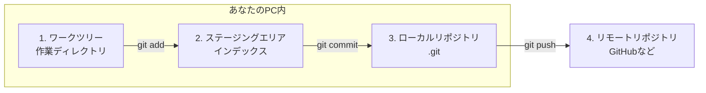
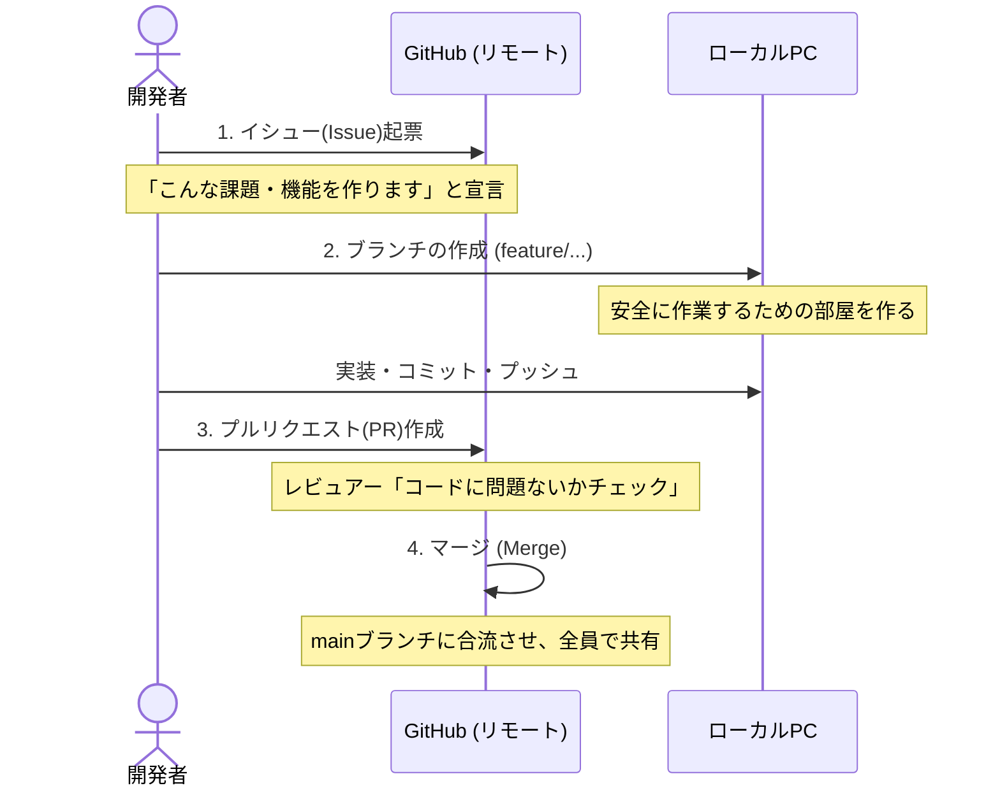
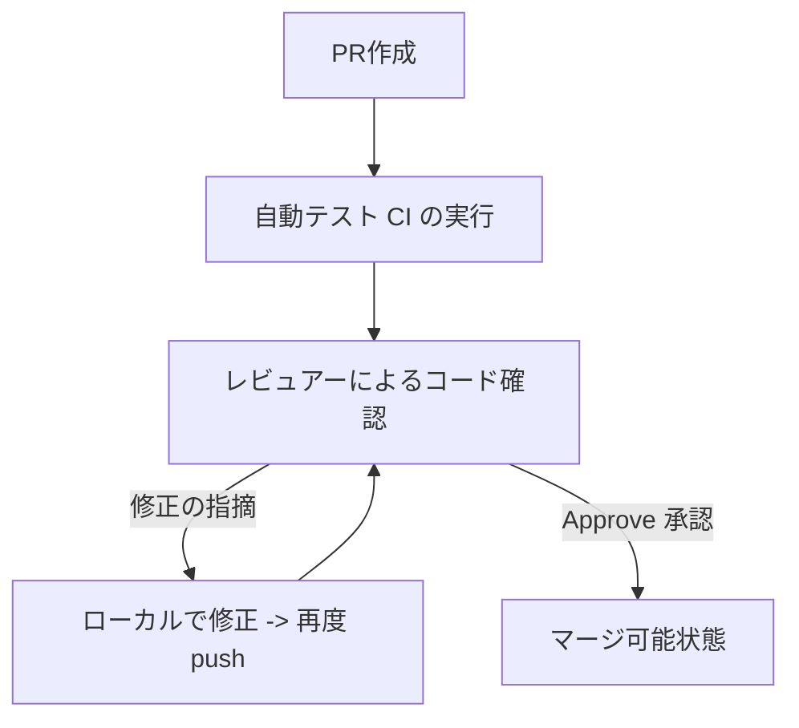

# チーム開発におけるGit/GitHub実践ガイド：なぜやるのかから学ぶ

本ドキュメントは、Git/GitHubを単なる「ツール」として使うのではなく、**「なぜその操作を行うのか」「なぜチーム開発で必要なのか」**という目的や背景からしっかり理解し、スムーズなチーム開発を行うための学習資料です。

---

## 1. はじめに：なぜチーム開発でGit/GitHubが必要なのか？

個人開発であれば、自分の好きなタイミングでコードを書き換え、保存するだけで問題ありません。しかし、**複数人のチームで1つのプロダクトを開発する**場合、そうはいきません。

### 個人開発とチーム開発の決定的な違い

* **ファイルの上書き問題**:
  AさんとBさんが同時に同じファイルを編集して保存すると、後から保存した方の内容で上書きされ、もう片方の変更が消えてしまいます。
* **「壊れていない状態」の維持（デプロイ管理）**:
  誰かが開発中の（バグが含まれている可能性のある）コードを本番環境やテスト環境に直接アップロードしてしまうと、サービス全体が停止するリスクがあります。
* **コードの品質と意図の共有**:
  「誰が、なぜ、どのコードを書き換えたのか」がわからないと、将来のバグ修正や機能追加の際に、誰も触れない「秘伝のソースコード」になってしまいます。

### 「直接mainブランチを書き換えてはいけない」根本的な理由
Gitには、本番環境にリリースするコードを管理する中心的な場所（通常は `main` または `master` ブランチ）があります。
ここに全員が直接コードをコミット（保存）してしまうと、バグのあるコードが混入した際、どのコミットが原因か特定することが困難になります。また、他のメンバーが常に最新の「動くコード」を手元に取得することができなくなってしまいます。

そのため、チーム開発では**「本番用のブランチ（main）は常に正常に動く状態に保ち、各自は隔離された安全な別部屋（ブランチ）で作業する」**という大原則があります。

---

## 2. Gitの超基本概念とコマンド

チーム開発の手順を学ぶ前に、まずGitの仕組み（概念）と基本的なコマンドを整理しましょう。

### 2.1 Gitの「3つのエリア」
Gitでは、ファイルが書き換えられてから保存されるまでに、以下の3つのステージ（エリア）を経由します。



1. **ワークツリー（作業ディレクトリ）**:
   実際にファイルを編集しているエディタ上の場所です。
2. **ステージングエリア（インデックス）**:
   コミット（セーブ）するファイルを選んで一時的に登録する場所です。
   * **なぜ「ステージ（add）」というステップが挟まるのか？**
     もし編集したファイルをすべて一度にコミットしなければならないとすると、関係のない一時的なメモや、別の作業のコードまで一緒に保存されてしまいます。「今回の機能追加に関係するファイルだけを選んでセーブする」ために、このステージングエリアが存在します。
3. **ローカルリポジトリ**:
   あなたのPC内で、変更履歴が正式に「コミット（セーブポイント）」として記録されるデータベースです。

### 2.2 まず覚えるべき基本コマンド6選

初学者がまず迷わずに使うべき基本コマンドです。

| コマンド | 役割 | 使うタイミング |
| :--- | :--- | :--- |
| `git clone <URL>` | リモートリポジトリを自分のPCにコピーする | 開発に参加した最初の1回だけ実行 |
| `git status` | 現在どのファイルが変更され、ステージされているかを確認する | 作業の合間に「今どうなってる？」を確認するとき |
| `git add <ファイル名>` | 変更したファイルをステージングエリアに追加する | コミットする前（※ `git add .` で全変更を追加可能） |
| `git commit -m "メッセージ"` | ステージされた変更をローカルリポジトリに記録する | 一区切りの実装が終わったとき（セーブポイント作成） |
| `git push origin <ブランチ名>` | ローカルリポジトリのコミットをGitHubに送信する | 自分の作業をチームに共有するとき |
| `git pull origin <ブランチ名>` | GitHubの最新の変更を自分のPCに取り込む | 朝の作業開始時など、他の人の変更を手元に反映させるとき |

---

## 3. ブランチの命名規則（Branch Naming Rules）

チーム開発では、それぞれの役割に応じたブランチを作成して作業します。誰がどのような目的でそのブランチを作ったのかが全員に一目で伝わるよう、チームごとにルール（命名規則）を定めます。

### 3.1 なぜ命名規則が必要なのか？
* **作業内容の予測可能性**: ブランチ名を見るだけで、「新機能を作っているのか」「バグを直しているのか」が判断できます。
* **自動化との連携**: CI/CD（自動テスト・デプロイツール）において、「`release/` から始まるブランチがプッシュされたら自動でテスト環境にデプロイする」といった設定が可能になります。

### 3.2 代表的なプレフィックス（接頭辞）
一般的には、ブランチ名の先頭に `カテゴリ/` をつける形式が採用されます。

| プレフィックス | 目的 | 具体的な用途 |
| :--- | :--- | :--- |
| **`feature/`** | 新機能の開発 | 画面の追加、新しいAPIの実装など |
| **`bugfix/`** | 不具合の修正 | 既存機能のバグ、エラーの修正 |
| **`hotfix/`** | 緊急の修正 | 本番環境で今すぐ修正が必要な重大なバグ対応 |
| **`docs/`** | ドキュメントの修正 | READMEの作成、仕様書の記述変更など |
| **`chore/`** | 雑務・設定変更 | ライブラリのアップデート、ビルド設定の変更など |

### 3.3 命名の具体例とルール
ブランチ名は、**「カテゴリ/イシュー番号-簡潔な英語の作業内容」**にするのが最も推奨されるパターンです。

* **良い例（Good）**:
  * `feature/#12-user-login`（イシュー #12 のユーザーログイン機能開発）
  * `bugfix/#45-payment-error`（イシュー #45 の決済エラー修正）
  * `docs/update-readme`（READMEの更新作業）
* **悪い例（Bad）**:
  * `my-work`（誰の何の作業か全くわからない）
  * `fix`（どのバグを直しているかわからない）
  * `feature/ログイン画面をつくる`（日本語やスペース、全角文字はエラーや文字化けの原因になるため避ける）

> [!IMPORTANT]
> **ブランチ名作成時の注意点**
> 1. 原則として半角英数字、ハイフン（`-`）、スラッシュ（`/`）を使用する。
> 2. アルファベットは大文字を避け、すべて**小文字（lower case）**にする（Windows/Mac/Linuxで大文字小文字の区別の挙動が異なりトラブルになるのを防ぐため）。

---

## 4. Git/GitHub チーム開発の4大ステップと「なぜやるのか？」

ここからがチーム開発の本番です。チーム開発は基本的に以下のサイクルで回ります。



---

### ステップ 1：イシュー（Issue）の起票
#### Q. イシューとは？
プロジェクトの「課題」「やることリスト（ToDo）」をGitHub上で管理するカードです。

#### Q. なぜやるのか？
1. **タスクの可視化**: 「誰が今、何のタスクを進めているか」がプロジェクト全体で見える化されます。
2. **重複作業の防止**: 相談なしに開発を始めると、AさんとBさんが同じバグ修正を別々に進めてしまう「無駄な衝突」が発生します。イシューに担当者を割り当てることでこれを防ぎます。
3. **仕様の事前合意**: コードを書く前に、「このイシューでは、具体的にどういう仕様で実装するか」をチームで議論・決定できます。

---

### ステップ 2：ブランチ（Branch）の作成
#### Q. ブランチとは？
元のコード（main）から分岐させた、自分専用の「コピー（作業部屋）」です。

#### Q. なぜやるのか？
1. **安全な作業スペースの確保**: mainブランチを汚すことなく、実験的なコードを書いたり、途中でバグらせたりしても他のメンバーに一切迷惑がかかりません。
2. **並行開発の実現**: Aさんは新機能（`feature/...`）、Bさんはバグ修正（`bugfix/...`）と、それぞれの部屋で同時に異なる作業を進められます。

---

### ステップ 3：プルリクエスト（Pull Request）の作成
#### Q. プルリクエスト（PR）とは？
自分の作業部屋（ブランチ）で書き換えたコードを、「本番部屋（main）に取り込んで（Pullして）ください」とチームに依頼（Request）する機能です。

#### Q. なぜやるのか？
1. **コードレビューによる品質担保**: 経験豊富なメンバーや同僚にコードをチェックしてもらうことで、バグの混入を防ぎ、より綺麗なコードに改善できます。
2. **ナレッジ（知識）の共有**: 「この機能はこういうロジックで実装したんだな」ということが、チーム全体に自然と伝わります。
3. **デプロイのコントロール**: レビューが通り、テストが成功したものだけを本番にマージするため、リリース物の品質が一定以上に保たれます。

---

### ステップ 4：マージ（Merge）
#### Q. マージとは？
プルリクエストが承認された後、作業ブランチの変更内容を `main` ブランチに合流（統合）させる操作です。

#### Q. なぜやるのか？
1. **成果物の統合**: 個別に行われた開発を1つのプロダクトとして合体させます。
2. **最新状態の更新**: マージされた最新の `main` は、他のメンバー全員が取得してベースにするための「新たな正解」となります。

---

## 5. ステップバイステップ：実践的なワークフローとコマンド

それでは、実際に開発を進めるときの具体的なコマンドとGitHubの操作の流れを見ていきましょう。

### 5.1 【GitHub】イシューの起票と担当者の割り当て
1. GitHubの「Issues」タブを開き、**[New issue]** をクリック。
2. タイトルと本文（目的、やりたいこと、完了条件）を書く。
3. 右側のメニューから自分を **[Assignees]**（担当者）に設定する。

### 5.2 【PC】最新のmainからブランチを作成する
作業を始める前に、必ず手元の `main` を最新にしてから、新しいブランチを作成します。

```bash
# 1. mainブランチに切り替える
git checkout main
# (または git switch main)

# 2. リモート(GitHub)の最新状態を手元に反映する
git pull origin main

# 3. 新しい作業ブランチを作成して切り替える
# 命名ルールに従い、イシュー番号と内容を含める
git checkout -b feature/#12-user-login
# (または git switch -c feature/#12-user-login)
```

### 5.3 【PC】コードを編集し、細かくコミットする
ファイルを編集したら、こまめにコミットを残します。

```bash
# 変更されたファイルを確認
git status

# 変更したファイルをステージングエリアに載せる
git add src/login.js

# コミットする（メッセージは「何をしたか」がわかるように）
git commit -m "feat: ユーザーログインのUI画面を追加"
```

> [!TIP]
> **コミットメッセージのコツ**
> メッセージの先頭に `feat:` (機能追加), `fix:` (バグ修正), `docs:` (ドキュメント) などの接頭辞（Git Commit Prefix）をつけると、後から履歴が見やすくなります。また、1つのコミットは「1つの意味ある変更単位」に抑え、巨大なコミットを避けるのがコツです。

### 5.4 【PC】GitHubへプッシュする
ある程度作業が進んだら、ローカルのブランチをリモート（GitHub）に送信します。

```bash
# 自分の作業ブランチをGitHubに送信
git push origin feature/#12-user-login
```

### 5.5 【GitHub】プルリクエスト（PR）の作成とレビュー
1. GitHubのリポジトリページに行くと、`Compare & pull request` という黄色いボタンが表示されるのでクリック。
2. タイトルと説明文を入力。
   * 説明文に `Closes #12`（#12はイシュー番号）と書くと、**このPRがマージされた瞬間にイシューが自動的にクローズ（完了）**されます。
3. **[Reviewers]** にレビューを頼みたいメンバーを指定する。
4. **[Create pull request]** をクリック。



### 5.6 【GitHub】マージと後片付け
レビューが承認（Approve）されたら、PRのページにある **[Merge pull request]**（または Squash and merge）をクリックしてマージします。

マージが完了したら、不要になったリモートブランチは **[Delete branch]** ボタンで削除します。

### 5.7 【PC】ローカル環境を最新に戻す
マージが完了したら、自分のPC（ローカル）も最新の状態にリセットします。

```bash
# 1. ローカルの main ブランチに戻る
git checkout main

# 2. GitHubでマージされた最新の main を手元にダウンロードする
git pull origin main

# 3. 役割を終えたローカルの作業ブランチを削除する（部屋の片付け）
git branch -d feature/#12-user-login
```

---

## 6. チーム開発でよくあるトラブルと対処法

複数人で同時に同じコードベースを触っていると、必ずトラブルが発生します。焦らずに対ぜましょう。

### 6.1 コンフリクト（衝突）が発生したとき

#### Q. コンフリクトとは？
AさんがとBさんが、「同じファイルの、同じ行」を異なる内容に書き換えて、それぞれをマージしようとしたときに発生します。Gitは「どちらの変更を採用すべきか自動で判断できない」ため、エラーを出して人間に判断を委ねます。

#### コンフリクトの解消手順

1. GitHub上、またはローカルで `git pull` や `git merge` をした際に「CONFLICT」と表示されます。
2. 対象のファイルを開くと、以下のような**競合マーカー**が挿入されています。

   ```javascript
   <<<<<<< HEAD
   console.log("Aさんが書いたログイン画面");
   =======
   console.log("Bさんが書いたログイン画面");
   >>>>>>> feature/#13-another-login
   ```
   * `<<<<<<< HEAD` から `=======` まで：**現在のブランチ（マージ先）**のコード
   * `=======` から `>>>>>>>` まで：**取り込もうとしているブランチ**のコード

3. **解決方法**:
   チームメンバーと相談し、どちらのコードを残すか（あるいは両方を組み合わせるか）を決め、**不要な行とマーカー（`<<<<<<<`, `=======`, `>>>>>>>`）を手動で削除**します。

   *修正後:*
   ```javascript
   console.log("相談して決めたログイン画面の正しいコード");
   ```

4. 修正が終わったら、再度コミットして完了です。
   ```bash
   git add <コンフリクトを直したファイル>
   git commit -m "fix: コンフリクトの解消"
   ```

---

### 6.2 ブランチの元データが古くなってしまったとき

自分が作業している間に、他のメンバーが別のPRをマージして `main` ブランチがどんどん進んでしまうことがあります。
このままだと、PRを出したときにコンフリクトを起こす可能性が高くなります。

定期的に、**作業中のブランチに最新の `main` の変更を取り込む**ようにしましょう。

#### 対処法：`git merge` を使う方法（初学者に最もおすすめ）

```bash
# 1. 自分の作業ブランチにいることを確認
git status

# 2. リモートの最新情報を取得
git fetch origin

# 3. リモートの最新の main を自分のブランチに合流させる
git merge origin/main
```

---

## 7. 実践ハンズオン：実際に手を動かして体験してみよう！

学習したワークフローを、実際のファイルを使ってローカルPC上で体験してみましょう。

### ハンズオンの目的
練習用の自己紹介テンプレート（`profile_template.md`）を利用して、**「自分専用の自己紹介ファイルを作成し、mainブランチにマージするまで」**の流れを一人二役（開発者とレビュアー/マージャー）で実践します。

---

### 【準備】Gitの初期設定（最初だけ）
Gitを使うPCで、あなたの名前とメールアドレスが設定されているか確認します（未設定の場合、コミット時にエラーになります）。

```bash
git config --global user.name "あなたの名前"
git config --global user.email "your-email@example.com"
```

---

### 【実践スタート】

#### Step 1: イシュー（やること）の確認
今回のタスクは以下の通りです。
* **課題（イシュー）**: `練習リポジトリに自分の自己紹介シートを追加する`
* **担当者**: あなた
* **ブランチ命名案**: `feature/issue-1-introduce-myself`

#### Step 2: 最新の main ブランチから新しいブランチを作る
安全な作業スペースを確保するため、新しくブランチを作成します。

```bash
# 1. main ブランチにいることを確認
git checkout main

# 2. リモートの最新状態を取り込む（※今回はローカル練習なので最新であることを前提とします）
git pull origin main

# 3. 新しい作業用ブランチを作成して切り替える
git checkout -b feature/issue-1-introduce-myself
```

#### Step 3: ファイルを作成・編集する
1. ワークスペースにある [profile_template.md](file:///d:/zerotoone-git/profile_template.md) を開きます。
2. このファイルの内容をすべてコピーします。
3. 同じフォルダ（ディレクトリ）に、新しく `profile_yourname.md` （例: `profile_taro.md` など、ご自身の名前）というファイルを新規作成し、コピーした内容を貼り付けます。
4. ファイル内のプレースホルダー（`[ここに名前を書いてください]` など）を自分の情報に書き換えて保存します。

#### Step 4: 変更をステージングエリアに追加し、コミットする
作成したファイルをセーブポイント（コミット）に記録します。

```bash
# 1. 現在のステータスを確認（新しく作成したファイルが赤字で表示されます）
git status

# 2. 作成したファイルをステージングエリアに載せる
# （例: ファイル名が profile_taro.md の場合）
git add profile_taro.md

# 3. 再度ステータスを確認（ファイルが緑字に変わり、コミット準備完了になります）
git status

# 4. コミットを実行する
git commit -m "feat: taroの自己紹介シートを追加"
```

#### Step 5: リモートリポジトリ（GitHub）にプッシュする
作成したコミットをGitHubに送信します。

```bash
git push origin feature/issue-1-introduce-myself
```

> [!NOTE]
> **※ローカル環境のみで完全にシミュレートする場合**
> もし今回のハンズオンをGitHubに接続せずローカルだけで練習している場合は、リモート（GitHub）への `push` はエラーになります。その場合は、擬似的にローカル内で `main` ブランチに直接マージする体験をします（次のStep 6をローカルコマンドで実行します）。

#### (ローカル完結用) Step 6: ローカルでマージする体験
GitHubを使わずに、ローカルで変更を `main` に合流させる操作です。

```bash
# 1. 本番用のブランチ（main）に移動する
git checkout main

# 2. あなたが作ったブランチの変更を main に合流させる（マージ）
git merge feature/issue-1-introduce-myself

# 3. 正常に自己紹介ファイルが main ブランチに入ったことを確認する
# フォルダ内に新しく作成した `profile_yourname.md` が存在しているはずです。
```

#### Step 7: 後片付け（ブランチの削除）
無事にマージ（統合）が完了したら、役割を終えたブランチは削除して整理整頓します。

```bash
# 1. mainブランチにいることを確認
git status

# 2. 不要になった作業ブランチをローカルから削除する
git branch -d feature/issue-1-introduce-myself
```

---

## まとめ

一度この手順通りにファイルをコピーして名前を書き換え、`add` -> `commit` -> `merge` までの流れを実行してみてください。
実際にエラーを出したり、コマンドの反応を見たりすることが、Git習得への一番の近道です！
