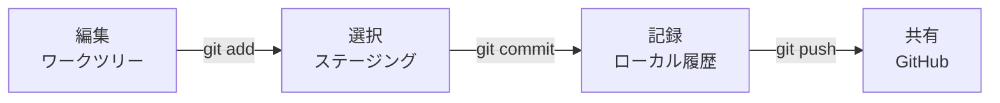

# 第2章：Gitの基本概念・コマンド・`.gitignore`

## この章のゴール

**変更を選び、記録し、GitHubへ共有できる。**

## まず見る：変更が進む経路



| 場所 | 何があるか | 次の操作 |
|---|---|---|
| ワークツリー | 編集中のファイル | `git add` |
| ステージング | 次のコミットに含める変更 | `git commit` |
| ローカルリポジトリ | PC内のコミット履歴 | `git push` |
| リモートリポジトリ | GitHub上の共有履歴 | PRを作成 |

## 作業中に使うコマンド

| やること | コマンド | 成功の目印 |
|---|---|---|
| 初回だけ取得する | `git clone <URL>` | リポジトリのフォルダができる |
| 現在地を確認する | `git status` | ブランチ名と変更一覧が出る |
| ブランチを作る | `git switch -c <名前>` | `Switched to a new branch` |
| 変更を選ぶ | `git add <ファイル>` | `Changes to be committed`に移る |
| 変更を記録する | `git commit -m "説明"` | コミットIDが表示される |
| GitHubへ送る | `git push -u origin <ブランチ>` | GitHubにブランチが表示される |
| 最新版を取り込む | `git pull origin main` | 更新内容または`Already up to date`が出る |

> [!TIP]
> 迷ったら、次の操作を推測せずに`git status`を実行します。

## `origin`とは

`origin`は、通常、clone元のリモートリポジトリに付く短い名前です。

```text
git pull origin main
         │      └─ 対象ブランチ
         └──────── リモートの名前
```

## `.gitignore`で共有しないものを決める

| 共有しないもの | 例 | 理由 |
|---|---|---|
| 機密情報 | `.env` | 漏洩を防ぐ |
| 復元できる依存物 | `node_modules/` | 容量を増やさない |
| ビルド成果物 | `dist/` | 自動生成できる |
| OSの一時ファイル | `.DS_Store` | 不要な差分を防ぐ |

```gitignore
node_modules/
.env
*.local
.DS_Store
Thumbs.db
dist/
build/
```

> [!WARNING]
> `.gitignore`は、すでにコミットしたファイルを履歴から消しません。機密情報をpushした場合は[第5章](05_troubleshooting_and_recovery.md)を確認してください。

## 完了チェック

- [ ] 変更が4つの場所をどう移動するか説明できる
- [ ] `git status`で現在の状態を確認できる
- [ ] `git add`と`git commit`の違いが分かる

---

* [前へ：第1章](01_why_git_and_github.md)
* [総合目次](git_team_development_guide.md)
* [次へ：第3章](03_branch_naming_rules.md)
