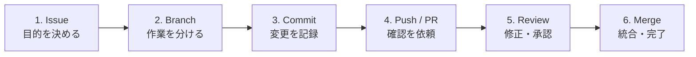

# 第4章：チーム開発のワークフロー

## この章のゴール

**Issueを受け取り、PRをマージしてIssueを完了できる。**

## まず見る：1つのIssueが完了するまで



## 手順早見表

| 段階 | やること | 完了の目印 |
|---|---|---|
| Issue | 目的・作業・完了条件を書く | 担当者が決まっている |
| Branch | 最新の`main`から作る | 作業ブランチへ移動済み |
| Commit | 関係する変更だけ記録する | `git status`が意図どおり |
| PR | `Closes #番号`を付ける | レビュアーが判断できる |
| Review | 指摘を同じブランチで直す | 承認・テスト完了 |
| Merge | PRを統合する | Issueが閉じる |

## 1. Issue：作業の入口を作る

Issueには次の3点を書きます。

```markdown
## 目的
チームメンバーがお互いの役割を確認できるようにする。

## やること
- profile_template.mdを複製する
- profiles/<名前>.mdを作成する

## 完了条件
- [ ] 必須項目が記入されている
- [ ] profiles/に保存されている
```

## 2. Branch：最新の`main`から分ける

```bash
git switch main
git pull origin main
git switch -c feature/issue-12-add-profile
```

## 3. Commit：変更を確認して記録する

```bash
git status
git add profiles/taro.md
git commit -m "feat: taroのプロフィールを追加"
```

> [!TIP]
> `feat:`は機能、`fix:`は不具合、`docs:`は文書の変更を表します。チームの規則があればそちらを使います。

## 4. Push / PR：レビューを依頼する

```bash
git push -u origin feature/issue-12-add-profile
```

PR本文には、最低限次を含めます。

- 何を変更したか
- どう確認したか
- `Closes #12`（マージ時にIssueを閉じる）

## 5. Review：同じPRへ修正を追加する

```text
レビュー指摘 → ファイル修正 → add → commit → push
                                      ↓
                              開いているPRへ自動反映
```

```bash
git add profiles/taro.md
git commit -m "fix: プロフィールの記載漏れを修正"
git push
```

> [!IMPORTANT]
> 指摘を受けても、PRやブランチを作り直しません。同じブランチへpushします。

## 6. Merge：統合して片付ける

GitHubで承認とテスト結果を確認し、チームの規則に合う方法でマージします。その後、ローカルを更新します。

```bash
git switch main
git pull origin main
git branch -d feature/issue-12-add-profile
```

## 完了チェック

- [ ] Issueの完了条件をすべて満たした
- [ ] PRに変更内容と確認方法を書いた
- [ ] レビュー指摘を同じPRへ反映した
- [ ] マージ後にIssueが閉じた

---

* [前へ：第3章](03_branch_naming_rules.md)
* [総合目次](git_team_development_guide.md)
* [次へ：第5章](05_troubleshooting_and_recovery.md)
