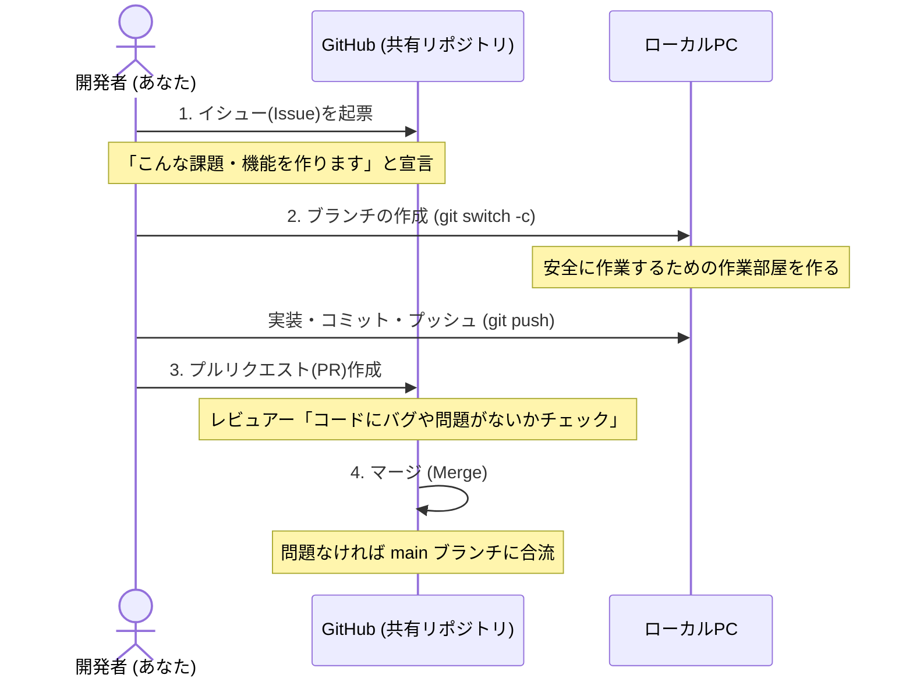

# 第4章：チーム開発のワークフロー

複数人のチームで開発を行う場合、ただ各自がコードを書くだけでなく、一定の決められた「型（フロー）」に従って開発を進めることで、安全で品質の高いコードを維持できます。

---

## 4.1 チーム開発の4大ステップ

チーム開発は、基本的に以下のサイクルを繰り返します。



---

## 4.2 具体的な実践手順とコマンド

実際に開発を進めるときの操作手順です。コマンドはすべて `switch` を使用します。

### ステップ 1：【GitHub】イシューの起票と担当者の割り当て
1. GitHubの「Issues」タブを開き、**[New issue]** をクリック。
2. タイトルと本文（目的、やること、完了条件）を書く。
3. 右側のメニューから自分を **[Assignees]**（担当者）に設定する。

### ステップ 2：【PC】最新のmainからブランチを作成する
手元のPCで作業部屋（ブランチ）を作ります。必ず **最新の `main`** から分岐させます。

```bash
# 1. 本番用ブランチ (main) に切り替える
git switch main

# 2. リモート(GitHub)の最新状態を手元に反映する
git pull origin main

# 3. 新しい作業用ブランチを作成して切り替える
# （例：イシュー番号 #12 のログイン画面作成の場合）
git switch -c feature/#12-user-login
```

### ステップ 3：【PC】コードを編集し、細かくコミットする
ファイルを編集したら、こまめにコミット（セーブ）を残します。

```bash
# 1. 変更されたファイルを確認
git status

# 2. 変更したファイルをステージングエリアに載せる
git add src/login.js

# 3. コミットする（メッセージは「何をしたか」がわかるように）
git commit -m "feat: ユーザーログインのUI画面を追加"
```

> [!TIP]
> **コミットメッセージのプレフィックス**
> メッセージの先頭に `feat:` (新機能)、`fix:` (バグ修正)、`docs:` (ドキュメント) などをつけると、後から履歴が見やすくなります。

### ステップ 4：【PC】GitHubへプッシュする
ある程度作業が進んだら、ローカルのブランチをリモート（GitHub）に送信します。

```bash
# 自分の作業ブランチをGitHubに送信
git push origin feature/#12-user-login
```

### ステップ 5：【GitHub】プルリクエスト（PR）の作成とレビュー
1. GitHubに行くと、`Compare & pull request` ボタンが表示されるのでクリック。
2. タイトルと説明文を入力。
   * **Tips**: 説明文に `Closes #12`（#12はイシュー番号）と書くと、**このPRがマージされた瞬間にイシューが自動的にクローズ（完了）**されます。
3. 右メニューの **[Reviewers]** にレビューを頼みたいメンバーを指定する。
4. **[Create pull request]** をクリック。

> [!IMPORTANT]
> **超重要：レビューで「修正指示」が出たときの対応方法**
> 指摘を受けてコードを修正する際、**「新しくPRを作り直したり、PRを閉じたり」する必要は一切ありません！**
> 1. ローカルPCでそのままファイルを修正します。
> 2. `git add` および `git commit` を行います。
> 3. 同じブランチ名で再度 `git push origin <ブランチ名>` を実行します。
> 
> これだけで、**すでに開いているGitHub上のPRに自動的に新しいコミット（修正）が追加・反映されます。**

### ステップ 6：【GitHub】マージと後片付け
レビュアーから **[Approve]**（承認）が得られたら、PRのページにある **[Merge pull request]**（または Squash and merge）をクリックしてマージします。
マージが完了したら、不要になったリモートブランチは **[Delete branch]** ボタンをクリックして削除します。

### ステップ 7：【PC】ローカル環境の片付けとリセット
マージが完了したら、自分のPC（ローカル）も最新の状態に戻して、次の開発に備えます。

```bash
# 1. 本番用ブランチ (main) に戻る
git switch main

# 2. GitHubでマージされた最新の main を手元に取り込む
git pull origin main

# 3. 役割を終えたローカルの作業ブランチを削除する（部屋の片付け）
git branch -d feature/#12-user-login
```

---

## 4.3 チームでのコミュニケーション

チーム開発を円滑にするためのマナーです。

* **レビュー依頼の明示**: PRを作成したら、SlackやTeamsなどで「#12 ログイン機能のPRを作成しました。レビューお願いします！」とリンクを添えて共有すると親切です。
* **LGTM（Looks Good To Me）**: レビューして問題がなければ、コメントに「LGTMです！👍」と書いてApproveすると、マージしてよいという合図になります。

---

* [前へ（第3章：ブランチの命名規則）](03_branch_naming_rules.md)
* [総合目次に戻る](git_team_development_guide.md)
* [次の章（第5章：トラブルシューティングとリカバリー方法）へ進む](05_troubleshooting_and_recovery.md)
